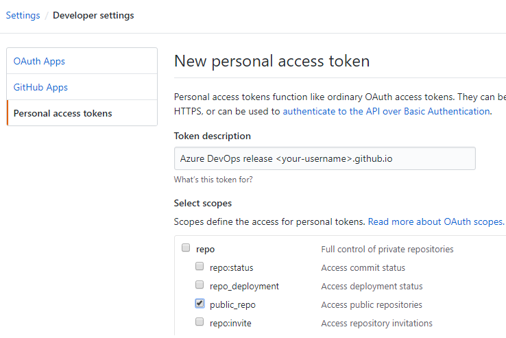
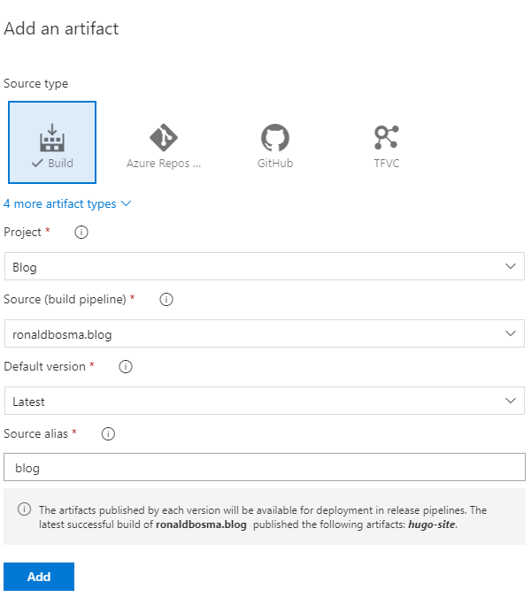
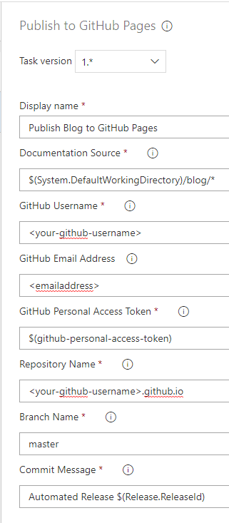

In this post I'll give a step-by-step explanation on how I build and publish my Hugo blog site to GitHub Pages using Azure Pipelines.

I'm using [Hugo](https://gohugo.io) to create my blog site. It lets me create my posts in markdown and with a simple command generate a static website. This website is hosted on my personal [GitHub Pages](https://pages.github.com/) site. GitHub Pages allows me to turn content in a git repository into a website and host it online.

My goal was to publish changes to my blog whenever I push a change to the master branch of my blog repository. Before I go into the details of how I did this, let’s first have a look at what I started with. 

I used the instructions on [Hosting Hugo site on GitHub](https://gohugo.io/hosting-and-deployment/hosting-on-github/) to create 2 git repositories.  
1. A `blog` repository containing my markdown files, Hugo templates, theme, etc.  
2. A `<username>.github.io` repository that is the source of my GitHub Pages site.

The `ronaldbosma.github.io` repository was included as a submodule in the `blog` repository. This allowed me to run the Hugo command and generate the static website in the `ronaldbosma.github.io` repository. The image below shows a graphical representation of this.


<!--  -->

As per the instructions I used a `deploy.sh` script to generate the Hugo static website in the public folder and push any changes to `ronaldbosma.github.io`. This has a few disadvantages though.

First off it's a manual action which can be forgotten easily. Also, I'm a developer and I dislike doing things manually.

I also prefer to create separate branches for my posts so I can create a pull request and ask my peers for feedback. The `deploy.sh` script can be run from every branch. Possibly publishing something I don't want to or removing changes I haven't merged from master yet.

The last problem I had was that for some reason the link to the submodule seemed to disappear. Making pushing any changes to `ronaldbosma.github.io` impossible. As a pragmatic solution I just removed and added the submodule manually. Which was cumbersome.

What I wanted was to automatically build and release my blog whenever I push a change in the master branch of my `blog` repository. I used Azure Pipelines to make this happen. The image below shows the various steps that are executed in the pipeline.


<!--  -->

First a build pipeline is triggered whenever I push to master. Using a Hugo build task the static site is generated and published as an artifact of the build. When the build succeeds a release pipeline is triggered which will take the site and push this into the `ronaldbosma.github.io` repository using a Publish to GitHub Pages task.

Although I'm interacting with a git repository when I publish my site, I decided to put this step in a release pipeline and not a build pipeline. I'm releasing my site here. Not building it. This also allows me to add more stages to for example a testing environment or change the target location and type of my site altogether without affecting my build pipeline.

There's another advantage to this solution besides having to do less manual work when publishing new changes to my blog. I can set a publish date in my posts. Posts with a publish date in the future will be ignored when generating my Hugo site. By scheduling my build pipeline to trigger at a regular interval I'm able to schedule posts to be published in the future.

In the next section of this post you'll find a step-by-step explanation of what I did to create this pipeline.

- [Step 1: Prerequisites](#step-1-prerequisites)
  - [1.1 Install the Hugo extension](#1-1-install-the-hugo-extension)
  - [1.2 Install the GitHub Pages Publish extension](#1-2-install-the-github-pages-publish-extension)
  - [1.3 Generate GitHub Personal Access Token](#1-3-generate-github-personal-access-token)
- [Step 2: Remove submodule](#step-2-remove-submodule)
- [Step 3: Build Hugo site](#step-3-build-hugo-site)
  - [3.1 Create build pipeline linked to GitHub](#3-1-create-build-pipeline-linked-to-github)
  - [3.2 Configure build pipeline](#3-2-configure-build-pipeline)
- [Step 4: Publish Hugo site](#step-4-publish-hugo-site)

If you already have experience with Azure Pipelines in combination with GitHub repositories you can just setup the [Prerequisites](#step-1-prerequisites) and jump right into configuring the [build pipeline](#3-2-configure-build-pipeline) and [release pipeline](#step-4-publish-hugo-site).

### Step 1: Prerequisites

You'll need an Azure DevOps project that has the 'Pipelines' Azure DevOps service enabled. You can enable this service in your Project settings.

There are also two extension we'll need to install from the Marketplace. These will be installed at the Organization level in Azure DevOps. So be sure you have the proper permissions.

_Both extension use PowerShell. So if you're unable to install these extension. Have a look at the PowerShell scripts in their GitHub repositories. You might find what you need._

#### 1.1 Install the Hugo extension

We're going to use the Hugo extension to generate our Hugo site. You can find it [here](https://marketplace.visualstudio.com/items?itemName=giuliovdev.hugo-extension) in the Marketplace. You'll have to sign in first before you can actually install the extension.

After signing in. Click 'Get it free'. Select your Azure DevOps organization and click 'Install'.

#### 1.2 Install the GitHub Pages Publish extension

We also need the GitHub Pages Publish extension to publish our Hugo site to GitHub Pages. You can find it [here](https://marketplace.visualstudio.com/items?itemName=AccidentalFish.githubpages-publish) in the Marketplace. You need version 1.0.0 or higher. It has the option to change the branch to master instead of using gh-pages.

Click 'Get it free' again. Select your Azure DevOps organization and click 'Install'.

#### 1.3 Generate GitHub Personal Access Token

The Publish to GitHub Pages task requires a GitHub Personal Access Token to access the GitHub Pages repository. Create one using these steps.

- Browse to https://github.com/settings/tokens/new.
- Enter your password if requested.
- Enter a description.
- Check the public_repo option.  
 
 <!--  -->
- Click 'Generate token' at the bottom of the page.
- Store the token for later use.

### Step 2: Remove submodule

If you've included your GitHub Pages repository as a submodule to your blog repository like me. You can remove the submodule, because you don't need it anymore. Follow these steps:

- Delete the 'public' submodule section from the .gitmodules file.
- Stage the .gitmodules changes: `git add .gitmodules`.
- Delete the 'public' submodule section from the .git/config file.
- Run `git rm --cached public` (no trailing slash).
- Remove the folder '.git/modules/public'.
- Commit `git commit -m "Removed public submodule"`.
- Delete the now untracked public folder from your cloned repo.

### Step 3: Build Hugo site

Now that we're finished with the preparations it's time to generate our Hugo site.

#### 3.1 Create build pipeline linked to GitHub

We'll start with a new build pipeline. You can follow the steps below or have a look at [create your first pipeline](https://docs.microsoft.com/en-us/azure/devops/pipelines/get-started-yaml?view=azure-devops) for a detailed description.

- Open your Azure DevOps project.
- In the left menu choose Pipelines > Builds.
- Click the 'New pipeline' button.
- Select 'GitHub' as the source of your code.
- Select your blog repository containing your Hugo templates, themes, markdown posts, etc.
- Install Azure Pipelines in your GitHub account if you haven't already.
- Authorize Azure Pipelines to access your GitHub resources.
- Select the pipeline template you want to start from. In our case the 'Starter pipeline' will do.
- An editor is opened where you can configure your pipeline using yaml. Remove all content from the .yml file. We'll start from scratch in the next section.

#### 3.2 Configure build pipeline

The first thing to do is [configure a trigger](https://docs.microsoft.com/en-us/azure/devops/pipelines/yaml-schema?view=azure-devops&tabs=schema#triggers). The following will make the build pipeline trigger whenever a change is pushed to master.

```yaml
trigger:
- master
```

The Hugo task we're going to use, uses PowerShell. So we'll have to use a Windows VM as a build agent.

```yaml
pool:
  vmImage: 'vs2017-win2016'  # need a Windows host because the Hugo task uses PowerShell
```

I've included the Hugo theme I use as a submodule in my blog repository. This step will [checkout the blog repository including the theme submodule](https://docs.microsoft.com/en-us/azure/devops/pipelines/yaml-schema?view=azure-devops&tabs=schema#checkout).

```yaml
steps:
- checkout: self
  displayName: 'Checkout repository including submodules'
  submodules: true  # true so Hugo theme submodule is checked out
```

Next step is to generate the Hugo site. This will use the Hugo task we've installed earlier. The output will be generated to the artifact staging directory.  

```yaml
- task: HugoTask@1
  displayName: 'Generate Hugo site'
  inputs:
    destination: '$(Build.ArtifactStagingDirectory)'
```

_You can find a description of the possible task parameters [here](https://github.com/giuliov/hugo-vsts-extension/blob/master/README.md). Have a look at the [task.json](https://github.com/giuliov/hugo-vsts-extension/blob/master/hugo-task/task.json) if you need the exact input names._

The last step is to publish the generated Hugo site as an artifact of our build. This will make it possible to use the result in a release pipeline when publishing the site.

```yaml
- task: PublishPipelineArtifact@0
  displayName: 'Publish Hugo site as artifact'
  inputs:
    artifactName: 'hugo-site'
    targetPath: '$(Build.ArtifactStagingDirectory)'
```

That's it. You can click 'Save and run'. Provide a comment and click 'Save and run' again. This will create an 'azure-pipelines.yml' file in your blog repository which contains your build pipeline. You can find the final azure-pipelines.yml for my blog site [here](https://github.com/ronaldbosma/blog-code-examples/blob/master/BuildAndReleaseHugoSiteUsingAzurePipelines/azure-pipelines.yml).

Because of the trigger on master it will start a new build immediately. After your build succeeds it should contain an artifact as shown in the image below.  

<!--  -->

### Step 4: Publish Hugo site

Now that we have a successful build we can create a release pipeline. It will take the generated Hugo site and publish it to GitHub Pages.

_We're going to use a task to push the Hugo site to a GitHub repository. If you want to push to a local repository or have some extra requirements. Have a look at [this publish.ps1 script](https://github.com/JamesRandall/Vsts-GitHub-Pages-Publish/blob/master/buildAndReleaseTask/publish.ps1) that's used by the task._

To configure the release pipeline:

- Open your Azure DevOps project.
- In the left menu choose Pipelines > Releases.
- Click the 'New pipeline' button.
- Select the 'Empty job' template.
- Give the stage a name. E.g. 'GitHub Pages'.
- Click 'Add an artifact'.
- Select 'Build' as the source type.  
  As the source, select the build pipeline we've just created.  
  Enter a different source alias if you want, like 'blog'.  
  
  <!--  -->
  
- Enable the 'Continuous deployment trigger' so the release will automatically start after the build succeeds.  

<!--  -->
- Open the Tasks tab for the 'GitHub Pages' stage.
- Add the [Publish to GitHub Pages](https://marketplace.visualstudio.com/items?itemName=AccidentalFish.githubpages-publish) task installed in the prerequisites and configure it:
  - 'Documentation Source' should be `$(System.DefaultWorkingDirectory)/blog/*`. Where blog is the artifact alias you've configured.
  - Configure the 'GitHub Personal Access Token' as [a secret](https://docs.microsoft.com/en-us/azure/devops/pipelines/process/variables?view=azure-devops&tabs=yaml%2Cbatch#secret-variables) using a variable.  
  - Set 'Branch Name' to master.  
  
  <!--  -->
  
You can now trigger a new build. After the build succeeds the release will start and publish any change in your site to GitHub Pages.

With this pipeline it's a breeze to publish new changes to your blog. No more manual labor!