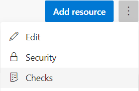
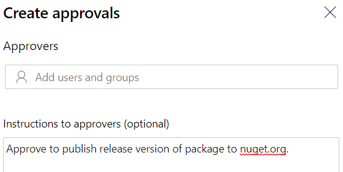

I've recently created [a new NuGet package](https://www.nuget.org/packages/FluentAssertions.ArgumentMatchers.Moq/) that I published on nuget.org. In order to make the process of creating and publishing this package as smooth and simple as possible, I've created a multi-stage YAML pipeline in Azure DevOps.

My preferred way of working with NuGet packages is to first create a prerelease version of a package and use it in my software. If I'm confident that it works I create a release version.

I've created a single pipeline to support this workflow, using the multi-stage pipelines feature that's currently in preview. This way a separate build & release pipeline is not necessary anymore and you can have your entire pipeline in YAML stored with your code.

The pipeline:

- builds my solution
- creates a prerelease version of my package
- creates a release version of my package
- automatically publishes the prerelease package to a private Azure DevOps Artifacts feed
- publishes the release version of the package to nuget.org if I give an approval

In this post I'll go into how the pipeline is set up.

First step is to enable the _multi-stage pipelines_ preview feature:

- Login to your Azure DevOps environment.
- Click on your avatar in the top right corner.
- Choose _Preview features_.
- Enable the _Multi-stage pipelines_ option.  

<!--  -->

Now that the preview feature is enabled we can start. So, create a new pipeline and connect it to one of the sources that supports YAML, like Azure Repositories or GitHub. You can choose any pipeline template, because we're going to clear it and start from scratch. The [Build, test, and deploy .NET Core apps](https://docs.microsoft.com/azure/devops/pipelines/languages/dotnet-core) documentation is a good starting point if you haven't created a pipeline before.

### Create NuGet packages

Clear the YAML editor and add the following YAML. This will build any projects in your git repository using the .NET Core 2.2 SDK.

```yaml
trigger:
- master

stages:

- stage: 'Build'
  variables:
    buildConfiguration: 'Release'

  jobs:
  - job:
    pool:
      vmImage: 'ubuntu-latest'

    workspace:
      clean: all

    steps:
    - task: UseDotNet@2
      displayName: 'Use .NET Core sdk'
      inputs:
        packageType: sdk
        version: 2.2.x
        installationPath: $(Agent.ToolsDirectory)/dotnet
    
    - task: DotNetCoreCLI@2
      displayName: "NuGet Restore"
      inputs:
        command: restore
        projects: '**/*.csproj'
    
    - task: DotNetCoreCLI@2
      displayName: "Build Solution"
      inputs:
        command: build
        projects: '**/*.csproj'
        arguments: '--configuration $(buildConfiguration)'
```

There are a few things to note. First the pipeline will trigger on a push to master. Next, we specify the `stages` keyword. Indicating that this is a multi-stage pipeline. In the first stage we'll build the solution and create the packages.

Since my package targets _netstandard2.0_, we're installing the .NET Core SDK as the first step in the stage using the [UseDotNet](https://docs.microsoft.com/en-us/azure/devops/pipelines/tasks/tool/dotnet-core-tool-installer?view=azure-devops) task. It allows us to specify a wildcard for the version. Ensuring that we're always using the latest available version of the .NET Core SDK.

Then we restore any NuGet packages we require and build the solution.

To keep the sample simple, I've left out additional steps to analyze the solution using SonarQube and run unit tests. You can find the full pipeline of my package including these steps [here](https://github.com/ronaldbosma/FluentAssertions.ArgumentMatchers.Moq/blob/master/azure-pipelines.yml).

Now that the solution can be build we can create our prerelease and release versions of the NuGet package.

To be able to create a prerelease package the first thing we need to do is configure a version prefix in the csproj of our project. See the example below.

```xml
<Project Sdk="Microsoft.NET.Sdk">
  <PropertyGroup>
    <VersionPrefix>1.2.0</VersionPrefix>
  </PropertyGroup>
</Project>
```

If you already have a `Version` tag specified, change this to `VersionPrefix`. This will make it possible to add a suffix to the version. Making it a prerelease package.

You might also have the `GeneratePackageOnBuild` property set to true. Although it can't hurt. It's not necessary. You can remove it if you want.

Now that we've prepared our project, go back to the pipeline editor and add the following YAML at the end.

```yaml
    - task: DotNetCoreCLI@2
      displayName: 'Create NuGet Package - Release Version'
      inputs:
        command: pack
        packDirectory: '$(Build.ArtifactStagingDirectory)/packages/releases'
        arguments: '--configuration $(buildConfiguration)'
        nobuild: true
    
    - task: DotNetCoreCLI@2
      displayName: 'Create NuGet Package - Prerelease Version'
      inputs:
        command: pack
        buildProperties: 'VersionSuffix="$(Build.BuildNumber)"'
        packDirectory: '$(Build.ArtifactStagingDirectory)/packages/prereleases'
        arguments: '--configuration $(buildConfiguration)'
```

The first task will create the release version of the package. The generated nupkg file will be created in the folder `packages/releases` of the artifact staging directory. The `nobuild` input is set to `true`. Meaning this task will not build the solution again.

The second task will create the prerelease version of the package. The output will be generated in the `packages\prereleases` folder. There are two differences with the release package task.

First of all. Using the `buildProperties` input we're adding the build number to the version of the package. Anything specified in the version suffix will be added after the version prefix, separated by a -. If the version prefix is `1.2.0` and the build number is `20190820.1`. Than the version of the package will be `1.2.0-20190820.1`.

The second difference is that the `nobuild` input is not specified. To add the version suffix to the package a build is necessary. Because of this, the order of these two tasks is also important. If you create the prerelease version first and then the release version (and have `nobuild` set to `true`), the release version assemblies will have a product version containing the prerelease suffix. The product version would be `1.2.0-20190820.1` instead of `1.2.0`.

The last step in the _Build_ stage is to publish the packages as an artifact of the pipeline. Making it possible to access them in subsequent stages. Add the following task to create a 'packages' artifact in the pipeline.

```yaml
    - task: PublishBuildArtifacts@1
      displayName: 'Publish Artifact'
      inputs:
        artifactName: 'packages'
        PathtoPublish: '$(Build.ArtifactStagingDirectory)/packages'
```

The _Build_ stage is now complete. You can run it to see if everything works. The next step is to publish the prerelease package.

### Publish prerelease package to Azure DevOps Artifacts feed

You can add the following YAML at the end of the pipeline yml file to publish the prerelease package.

```yaml
- stage: 'PublishPrereleaseNuGetPackage'
  displayName: 'Publish Prerelease NuGet Package'
  dependsOn: 'Build'
  condition: succeeded()
  jobs:
  - job:
    pool:
      vmImage: 'ubuntu-latest'

    steps:
    - checkout: none

    - task: DownloadPipelineArtifact@2
      displayName: 'Download NuGet package'

    - task: NuGetCommand@2
      displayName: 'Push NuGet Package'
      inputs:
        command: 'push'
        packagesToPush: '$(Pipeline.Workspace)/packages/prereleases/*.nupkg'
        nuGetFeedType: 'internal'
        publishVstsFeed: 'Test'
```

I've decided to use a [normal job](https://docs.microsoft.com/en-us/azure/devops/pipelines/yaml-schema?view=azure-devops&tabs=schema#job) instead of a [deployment job](https://docs.microsoft.com/en-us/azure/devops/pipelines/yaml-schema?view=azure-devops&tabs=schema#deployment-job). The reason is that you need an environment when using a deployment job and we don't have any need for it at this stage. We will for the last stage though.

This stage will start automatically after the _Build_ stage has succeeded. The first step `checkout: none` is to skip the checkout of the repository. We don't need any code checked out here. We only need the prerelease NuGet package which is available as an artifact.

That's where the second step comes in. The [DownloadPipelineArtifact](https://docs.microsoft.com/en-us/azure/devops/pipelines/tasks/utility/download-pipeline-artifact?view=azure-devops) task will download any artifacts that were published in the pipeline at an earlier stage. They will be available in the `$(Pipeline.Workspace)` folder.

The [NuGetCommand](https://docs.microsoft.com/en-us/azure/devops/pipelines/tasks/package/nuget?view=azure-devops) task will publish the prerelease package to an internal Azure DevOps Artifacts feed called 'Test'.

That's everything you need to publish the prerelease package. You can give the pipeline another run to see if it works.

### Publish release package to nuget.org

The last stage will publish the release version of the NuGet package to nuget.org. But before we proceed we'll need to make a few preparations.

#### Create new environment

In the 'old style' release pipelines, approvals were configured on stages itself. With the new multi-stage pipelines this has been moved to environments. So, we'll have to create an environment first.

- Click the _Environments_ menu item in the Azure DevOps portal.  
  (When you enabled the _multi-stage pipelines_ preview feature this new menu item appeared in the _Pipelines_ menu.)
- Choose _New environment_.
- Specify a name like 'nuget-org' (a . is not allowed) and an optional description.  

<!--  -->
- Click Create.

After the environment is created, open it to configure users or groups to give their approval before the package is published.

- Click on the button with three dots.
- Choose _Checks_.  

<!--  -->
- Click _Create_ in the new screen.
- Add users and groups and specify optional instructions for the approvers.  

<!--  -->
- Click _Create_.

The environment is now ready to deploy to.

#### Configure nuget.org service connection

To be able to push a package to nuget.org you'll need an account. Create an account on [nuget.org](https://www.nuget.org) if you haven't already and log in. Then create an api key as described [here](https://docs.microsoft.com/en-us/nuget/nuget-org/scoped-api-keys).

Using that api key we can create a [NuGet service connection](https://docs.microsoft.com/en-us/azure/devops/pipelines/library/service-endpoints?view=azure-devops&tabs=yaml#sep-nuget) in Azure DevOps following these steps:

- Go to _Project settings_.
- Choose _Service connections_.
- Add a new service connection of type 'NuGet'.
- Give the connection a name like 'NuGet'.
- Specify `https://api.nuget.org/v3/index.json` as the feed URL.
- Enter your api key.  

<!--  -->
- Click _OK_.

#### Publish NuGet package

Now that we have our environment and NuGet service connection configured we can add the last stage to the YAML pipeline. For this add the following YAML to the end of the pipeline yml file.

```yaml
- stage: 'PublishReleaseNuGetPackage'
  displayName: 'Publish Release NuGet Package'
  dependsOn: 'PublishPrereleaseNuGetPackage'
  condition: succeeded()
  jobs:
  - deployment:
    pool:
      vmImage: 'ubuntu-latest'
    environment: 'nuget-org'
    strategy:
     runOnce:
       deploy:
         steps:
         - task: NuGetCommand@2
           displayName: 'Push NuGet Package'
           inputs:
             command: 'push'
             packagesToPush: '$(Pipeline.Workspace)/packages/releases/*.nupkg'
             nuGetFeedType: 'external'
             publishFeedCredentials: 'NuGet'
```

You'll notice that this stage configuration looks a little different than the stage for the prerelease package. We're using a [deployment job](https://docs.microsoft.com/en-us/azure/devops/pipelines/yaml-schema?view=azure-devops&tabs=schema#deployment-job) to publish the package and have configured the `nuget-org` environment to be used by the job. Making sure that we first need to give an approval before the package is published to nuget.org.

Because of the deployment job we don't have to specify the `checkout: none` step. The repository will not be automatically checked out. The download pipeline artifact task is also not necessary here because the artifacts will be automatically downloaded to the `$(Pipeline.Workspace)` folder.

In the [NuGetCommand](https://docs.microsoft.com/en-us/azure/devops/pipelines/tasks/package/nuget?view=azure-devops) task we need to specify that the feed to push to is external. The `publishFeedCredentials` input is set to the name of the service connection we've created earlier.

And there you have it. A multi-stage pipeline that creates and publishes NuGet packages. If all stages pass you should have something like this.


<!--  -->

You can find the full example [here](https://github.com/ronaldbosma/blog-code-examples/blob/master/MultiStageYAMLPipelineToCreateAndPublishNuGetPackages/azure-pipelines.yml).